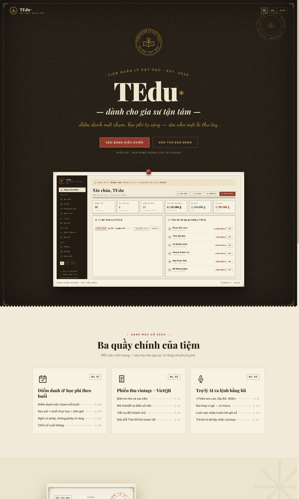
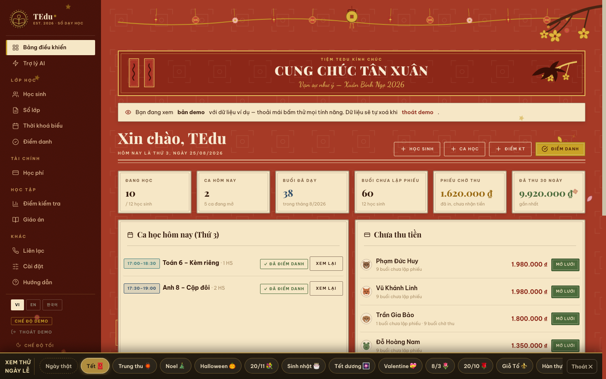
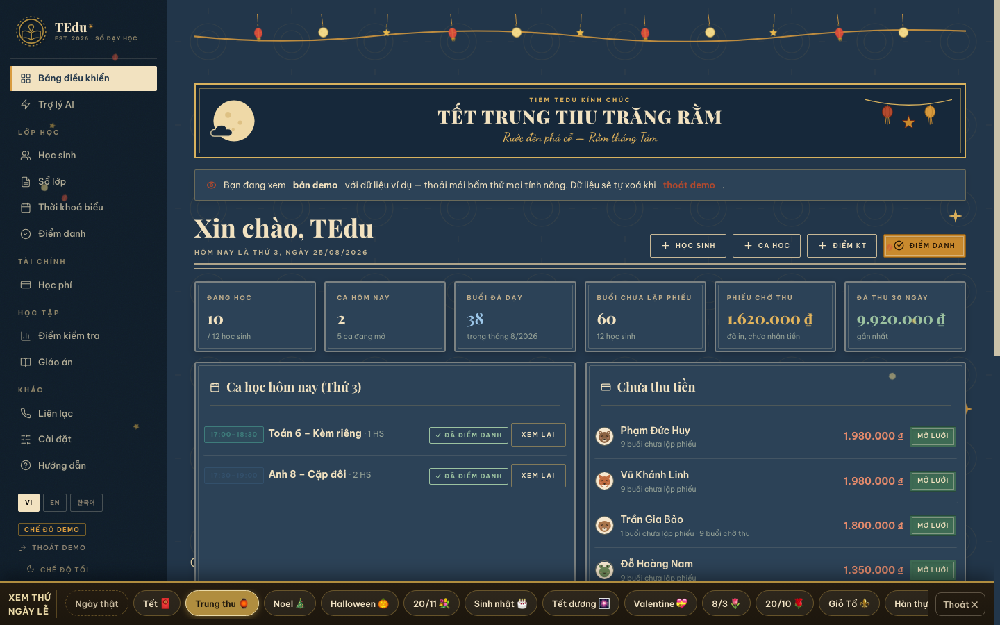
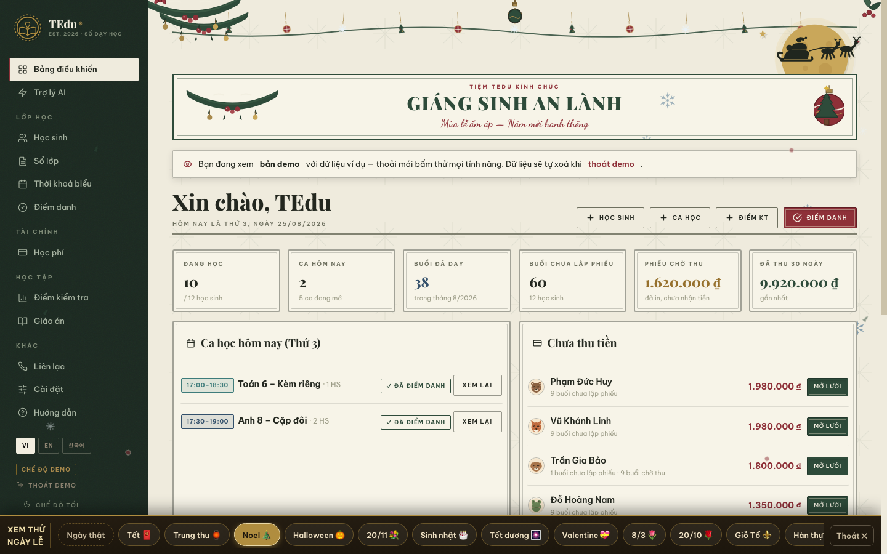
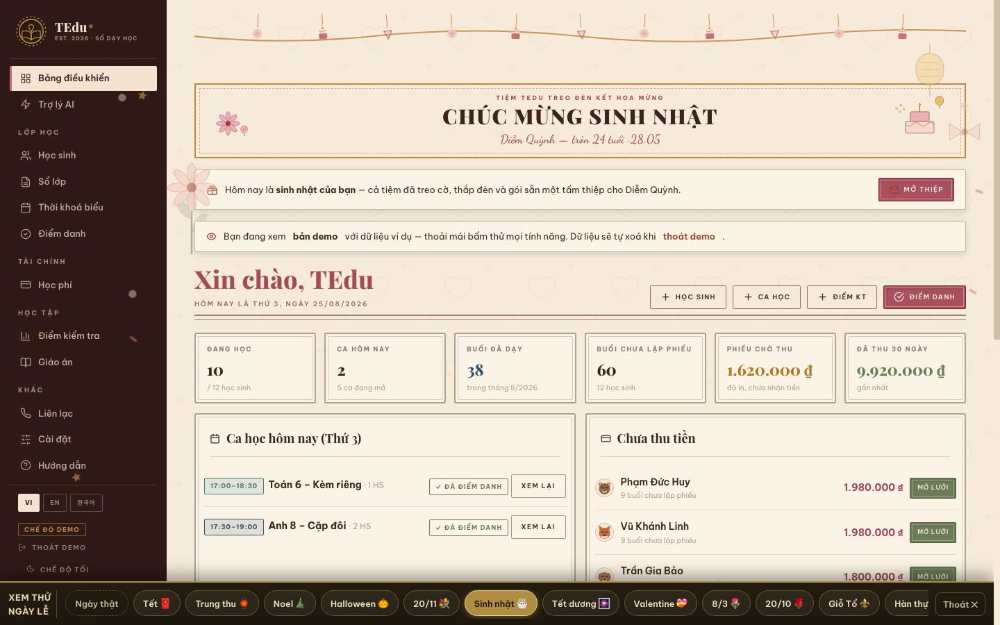

# TEDU ✳ — Tiệm quản lý dạy học

> **Monorepo full-stack** cho TEdu — sổ tay quản lý của gia sư / giáo viên dạy thêm,
> khoác áo "tiệm văn phòng phẩm Sài Gòn 1960": giấy ngà, mực sepia, triện đỏ, phiếu thu vintage.

<p align="center">
  <a href="https://tedu-app.netlify.app"><b>🌐 Bản chạy thật (Netlify)</b></a> ·
  <a href="https://doxuta.github.io/tedu/?preview"><b>🎨 Demo 20 theme ngày lễ</b></a> ·
  <a href="https://github.com/doxuta/tedu"><b>📦 Repo web một-file</b></a>
</p>



---

## Ba phần trong một repo

| Thư mục | Là gì | Công nghệ |
|---|---|---|
| **`TEdu-quan-ly-hoc-sinh.html`** | Toàn bộ web app trong **một file HTML** — mở là chạy, không cần cài gì | Vanilla JS · localStorage · IndexedDB · Firebase (tuỳ chọn) |
| **`server/`** | API backend tự chủ (thay thế Firebase khi muốn tự host) | TypeScript · Hono · Drizzle ORM · PostgreSQL · WebSocket |
| **`app/`** | Ứng dụng di động / desktop đa nền tảng | Flutter (iOS · Android · macOS · Windows · Linux) |

Ba phần **độc lập** — dùng riêng từng phần đều được. Web một-file là sản phẩm chính,
server + app Flutter là phiên bản tự chủ hạ tầng.

---

## Tính năng chính

**📒 Lớp học** — hồ sơ học sinh (thêm một-một hoặc dán cả bảng từ Excel), ca học theo kỳ,
sổ lớp, thời khoá biểu dạng lịch thật, điểm danh có mặt / vắng / trễ.

**💰 Tài chính** — học phí tự cộng theo buổi thực học × đơn giá; lưới buổi 3 màu kiểu Excel
(chưa lập phiếu → chờ thu → đã thu); **phiếu thu vintage** có số series, dấu bưu điện,
tiền bằng chữ, mã VietQR điền sẵn số tiền và con dấu đỏ "ĐÃ THU ĐỦ";
link phiếu gửi phụ huynh xem không cần tài khoản; báo cáo thu nhập + xuất CSV.

**📚 Học tập** — điểm kiểm tra + biểu đồ tiến bộ, giáo án, thư viện tài liệu mọi định dạng
(lưu ngay trong trình duyệt), cẩm nang A-Z có minh hoạ tương tác.

**🤖 Trợ lý AI** — ra lệnh tiếng Việt tự nhiên: *"thêm học sinh Lan lớp 8A môn Văn 160k"*,
*"điểm danh Toán 9 hôm nay"*, *"ai chưa đóng tiền?"* — luôn hiện thẻ xác nhận trước khi ghi sổ.
Chạy offline sẵn, dán key Gemini (miễn phí) là trò chuyện thoải mái. Có mic tiếng Việt 🎤.

**🎉 20 theme ngày lễ tự động — vĩnh viễn** — thuật toán âm lịch thiên văn (UTC+7) tính đúng
Tết, Trung thu, Giỗ Tổ... cho **mọi năm về sau**; banner ghi đúng năm can-chi
(Đinh Mùi 2027 → Mậu Thân 2028 → ...); mỗi dịp re-skin toàn app với hoạ tiết vẽ tay SVG,
dàn treo, hạt rơi — không dùng emoji.

**🎂 Sinh nhật cá nhân hoá** — đúng ngày 28/05, tài khoản Diễm Quỳnh nhận nguyên một
theme riêng: chân dung khung oval bưu hoa, thiệp toàn màn hình, confetti,
và **trò bói hoa** — bốc 1 trong 9 lá bài điềm lành, tuổi tự cộng đúng mỗi năm.

**☁️ Tài khoản & vận hành** — đăng nhập Google, mỗi giáo viên một sổ riêng tự đồng bộ,
chế độ demo đầy dữ liệu mẫu, trang quản trị (khoá tài khoản, bảo trì, thông báo),
chat giáo viên ↔ admin có báo email. Ba ngôn ngữ VI / EN / 한국어. Chế độ tối "giấy đêm"
(mặc định luôn sáng).

---

## Ảnh màn hình

### Theme Tết Nguyên Đán — giấy đỏ son, câu đối, mai vàng


### Theme Trung thu — đêm rằm navy, trăng và đèn lồng


### Theme Noel — giấy ngà, dải thông, tuyết rơi


### Sinh nhật Diễm Quỳnh 28·05 — cờ dây, gerbera, thiệp + bói hoa


> Xem trực tiếp cả 20 dịp: **https://doxuta.github.io/tedu/?preview** — thanh chuyển lễ ở cạnh dưới.
> Giao diện Flutter (app/) đồng bộ cùng ngôn ngữ thiết kế vintage với web.

---

## Chạy thử trong 30 giây

**Web (không cần cài gì):**
```bash
# mở thẳng file trong trình duyệt
open TEdu-quan-ly-hoc-sinh.html
```
hoặc vào https://tedu-app.netlify.app → bấm **"Xem thử bản demo"**.

**Server (tự host, cần Docker + Node 20+):**
```bash
docker compose up -d          # Postgres 16
cd server
cp .env.example .env          # điền secret của bạn
npm install
npm run db:migrate
npm run dev                   # http://localhost:3000
npm test                      # vitest — bộ test API
```

**App Flutter (cần Flutter SDK):**
```bash
cd app
flutter create .              # sinh lại platform scaffolding (đã gitignore)
flutter pub get
flutter run                   # chọn thiết bị: iOS / Android / macOS...
```
App trỏ tới server ở `app/lib/core/api_client.dart` (mặc định `localhost:3000`).

---

## Cấu trúc

```
TEDU/
├── TEdu-quan-ly-hoc-sinh.html   ← web app trọn vẹn trong 1 file (~1 MB)
├── docker-compose.yml           ← Postgres 16 cho server
├── docs/
│   ├── API.md                   ← tài liệu REST API
│   ├── ARCHITECTURE.md          ← kiến trúc tổng thể
│   └── screenshots/             ← ảnh trong README này
├── scripts/dev.sh               ← chạy cả server + app một lệnh
├── server/
│   ├── src/
│   │   ├── index.ts             ← khởi động Hono + WebSocket
│   │   ├── auth/                ← JWT, mật khẩu, routes đăng nhập
│   │   ├── db/                  ← schema Drizzle, migrate, DDL
│   │   └── modules/             ← students, classes, attendance, fees,
│   │                              files, stats, sync, admin
│   └── test/api.test.ts         ← kiểm thử tích hợp
└── app/
    └── lib/
        ├── core/                ← api client, app state, i18n, theme vintage
        ├── data/models.dart
        ├── features/            ← 12 màn hình: dashboard, students, classes,
        │                          attendance, fees + receipt, scores, lessons,
        │                          timetable, ai, admin, settings, auth
        └── widgets/vintage.dart ← bộ widget giấy ngà / triện / letterpress
```

## Kiến trúc & quyết định thiết kế

- **Web một-file là cố ý**: giáo viên không rành kỹ thuật chỉ cần *mở file* hoặc *mở link*.
  Không build step — sửa file, lưu, tải lại là xong. Dữ liệu localStorage (mỗi tài khoản một khoá),
  tài liệu nằm trong IndexedDB ngay trên máy, đồng bộ mây qua Firebase là **tuỳ chọn**.
- **Server tự chủ** dành cho ai muốn thoát Firebase: Hono (nhẹ, chuẩn Web API), Drizzle
  (schema là code TypeScript), realtime qua WebSocket, kiểm thử bằng Vitest.
- **Flutter một codebase** ra iOS/Android/desktop; bộ widget `vintage.dart` tái tạo đúng
  ngôn ngữ giấy-mực-triện của web.
- **Bảo mật**: `.env` và thư mục dữ liệu Postgres không bao giờ vào git (xem `.gitignore`);
  apiKey Firebase trong file HTML là public identifier theo thiết kế của Firebase —
  quyền truy cập thật nằm ở Firestore Security Rules.

## Giấy phép

MIT — dùng, sửa, chia sẻ thoải mái, giữ dòng bản quyền.

<p align="center">Kept with care ❦ TEdu · EST. 2026<br>
By <b>Matthew Doan</b> — TEducation · cùng Claude ☕</p>
