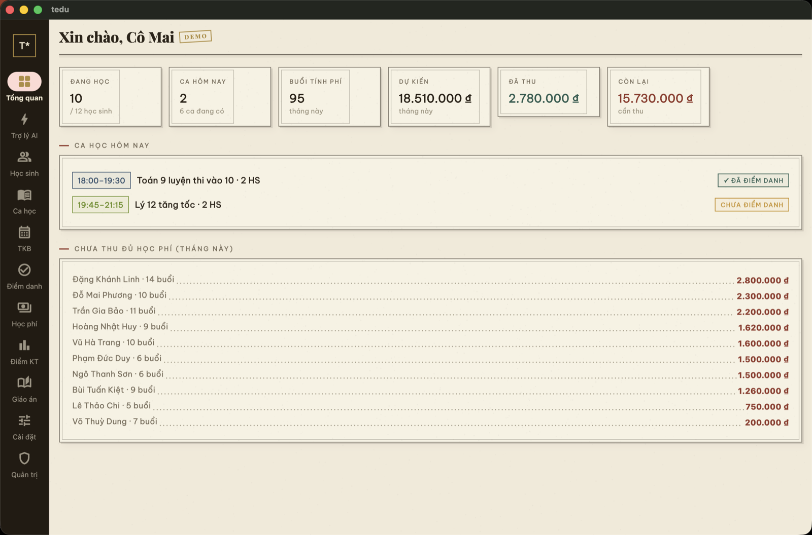
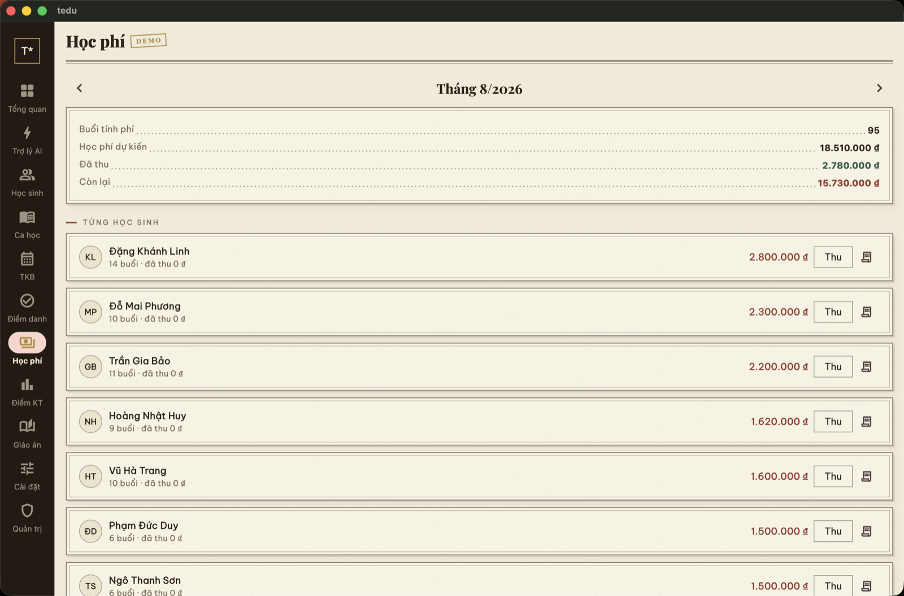
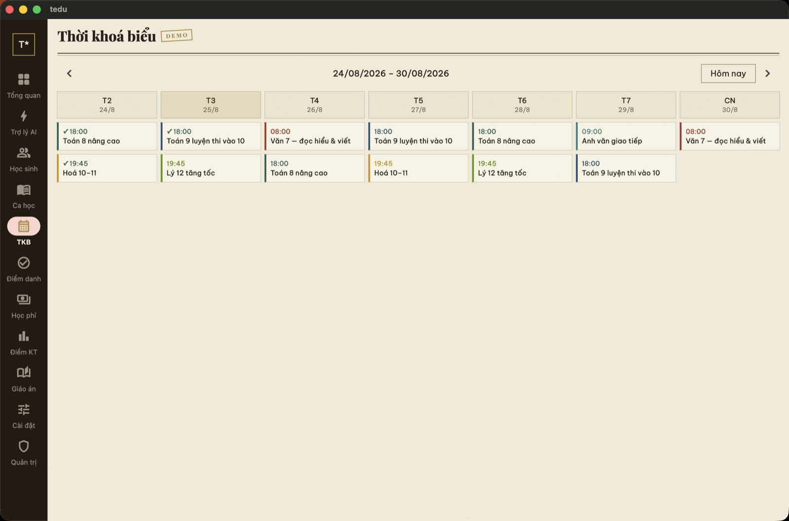
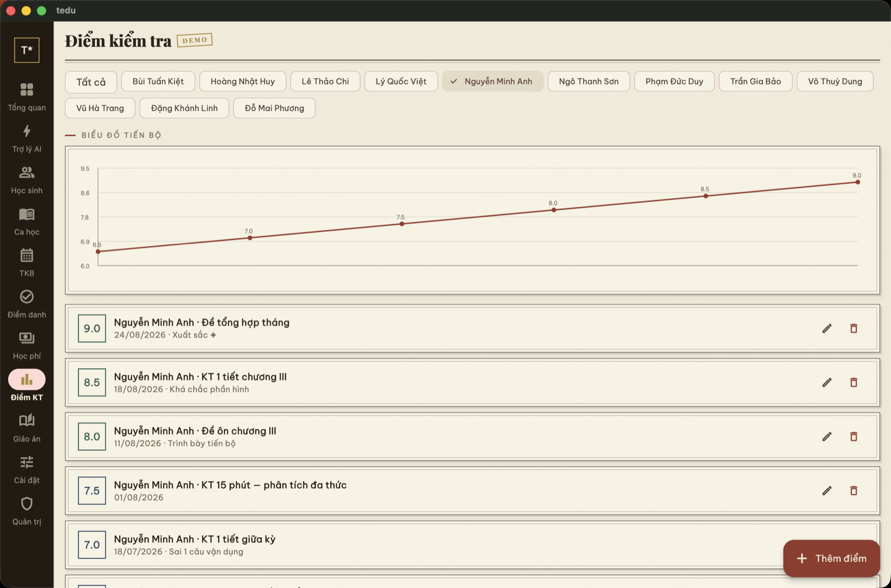

# TEdu — app Flutter đa nền tảng

> Sổ quản lý dạy học cho gia sư, phong cách "tiệm văn phòng phẩm Sài Gòn 1960".
> Một codebase chạy **macOS · Windows · Linux · iOS · Android**.
> **Có chế độ DEMO chạy ngay, không cần server, không cần tài khoản** — dành cho người muốn xem thử nhanh.



---

## Chạy thử trong 3 phút (dành cho người review / HR)

Chỉ cần **Flutter SDK** (bản ≥ 3.4 — [cài tại đây](https://docs.flutter.dev/get-started/install), ~10 phút nếu chưa có).
Không cần Docker, không cần Postgres, không cần file cấu hình nào.

```bash
git clone https://github.com/doxuta/tedu-fullstack.git
cd tedu-fullstack/app

flutter create .        # sinh lại thư mục platform (macos/windows/... đã gitignore)
flutter pub get
flutter run             # chọn thiết bị: macOS / Windows / máy ảo Android...
```

Khi app mở màn đăng nhập → bấm nút viền vàng **「 XEM THỬ BẢN DEMO 」**.

### Trong bản demo có gì?

Một "sổ" đầy dữ liệu mẫu tiếng Việt, gieo **theo ngày hiện tại** nên mở hôm nào cũng sống động:

| | |
|---|---|
| 👩‍🏫 12 học sinh | hồ sơ đủ phụ huynh, SĐT, đơn giá; có em đang học / tạm nghỉ / đã nghỉ |
| 📒 6 ca học | phủ đủ 7 ngày trong tuần — hôm nào cũng có lịch dạy |
| ✅ 8 tuần điểm danh | có mặt / muộn / vắng CP / vắng KP đan xen tự nhiên |
| 💰 Học phí 2 tháng | tháng trước gần thu đủ, tháng này còn nợ — đủ cả 3 trạng thái |
| 📈 Điểm kiểm tra | chuỗi điểm đi lên để xem biểu đồ tiến bộ |
| 📚 6 giáo án + tài liệu | nội dung buổi dạy, BTVN, file đính kèm mở được thật |
| 🧾 Phiếu học phí | xuất PDF A5 vintage, VietQR điền sẵn số tiền |
| 🛡 Trang quản trị | tài khoản demo là admin — xem được cả màn quản trị |

Mọi thao tác **thêm / sửa / xoá / điểm danh / thu tiền đều chạy thật** (trong bộ nhớ phiên demo).
Thoát demo ở **Cài đặt → Thoát bản demo**; mở lại demo là dữ liệu mẫu tươi mới.
Demo không đụng gì tới dữ liệu tài khoản thật trên máy.

| Học phí | Thời khoá biểu | Biểu đồ điểm |
|---|---|---|
|  |  |  |

---

## Kiểm chứng chất lượng

```bash
flutter analyze     # 0 cảnh báo
flutter test        # 17 test: nghiệp vụ học phí, điểm danh, demo, formatter
flutter build macos # (hoặc windows / apk) — build release thật
```

Bộ test đáng chú ý (`test/demo_test.dart`): học phí = số buổi tính phí × đơn giá,
điểm danh ghi đè theo (ngày, ca) không nhân đôi, thu tiền trừ đúng số còn lại,
bật "tính phí buổi vắng không phép" làm số buổi tăng, vào/ra demo không rò rỉ dữ liệu.

---

## Kết nối server thật (tuỳ chọn — không bắt buộc để review)

App online-first + cache offline + hàng đợi thao tác khi mất mạng, đồng bộ realtime qua WebSocket.
Server tự host nằm ở `../server` (TypeScript · Hono · Drizzle · PostgreSQL):

```bash
# từ thư mục gốc repo — cần Docker + Node 20+
./scripts/dev.sh            # bật Postgres + migrate + chạy server ở http://localhost:8787
```

Trong app: màn đăng nhập → dòng nhỏ **⚙ Máy chủ** → giữ `http://localhost:8787`
(máy ảo Android dùng `http://10.0.2.2:8787`) → Đăng ký tài khoản → dùng như bản thật.

---

## Kiến trúc

```
lib/
├── main.dart                  ← khởi động: AppState.init() → Login / Shell
├── core/
│   ├── api_client.dart        ← HTTP + Bearer, tự refresh token khi 401
│   ├── demo_api.dart          ← ★ máy chủ giả trong bộ nhớ: trả lời đúng các
│   │                             route REST của server thật + dữ liệu mẫu
│   ├── app_state.dart         ← singleton ChangeNotifier: phiên, cache,
│   │                             hàng đợi offline, WebSocket, demo mode
│   ├── theme.dart             ← hệ màu "giấy ngà – mực sepia – triện đỏ"
│   └── i18n.dart              ← VI / EN / 한국어
├── data/models.dart           ← Student, ClassModel, Attendance, Payment...
├── features/                  ← 12 màn: dashboard, students, classes, timetable,
│   │                             attendance, fees + receipt (PDF/VietQR),
│   │                             scores (chart), lessons (file đính kèm),
│   │                             ai, admin, settings, auth
│   └── shell.dart             ← rail desktop / bottom-tab mobile
└── widgets/vintage.dart       ← PaperCard, StampBadge, LetterpressButton,
                                  Postmark, Grain... bộ widget vintage dùng chung
```

Điểm thiết kế đáng nói: **mọi màn hình chỉ nói chuyện qua `AppState.api`** —
nên chế độ demo chỉ là thay `ApiClient` bằng `DemoApi` (kế thừa, ghi đè get/post/put/patch/delete),
không màn hình nào phải sửa một dòng. Muốn mock để test cũng theo đúng cửa đó.

Dark mode hiện có ở bản web (mặc định luôn sáng); bản Flutter giữ một tông giấy sáng —
đổi cả hệ màu tĩnh là việc trong lộ trình, chưa nằm trong bản này.

---

<p align="center">Sổ ghi chép cẩn thận ❦ TEdu · EST. 2026</p>
